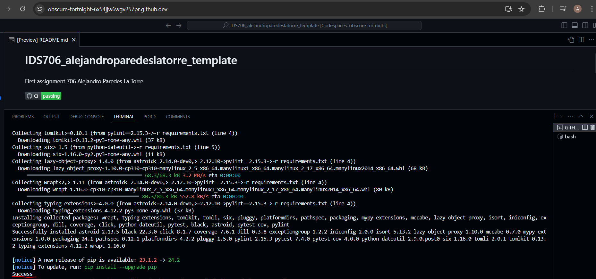
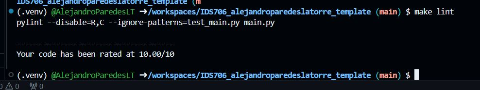
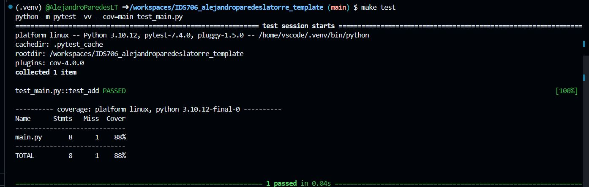

# IDS706_alejandroparedeslatorre_template
First assignment 706 Alejandro Paredes La Torre 

This repo contains my work for Create Python Gitlab Template assignment of IDS 706. If you want to use this just refer this to a codespace in github and wait for the devcontainer to execute the Makefile that execute the following: install, format, lint, test.

According to the requirement it gets added

* `Makefile`

* `Dockerfile`

* `requirements.txt` with a set of specifications

* `githubactions` 

* `.devcontainer` for Githubcodespace 

## Purpose of project
The purpose of this project is to have a python template that includes a main.py file that has only one function called print_custom_message(name, year, month, day) that takes as input a Name and a birthday split as year, month and day of birthday. This function returns the age of the input in years and months specified in the main part of the file. I test this function with the help of the file test_main.py

## Preparation
1. open codespaces 
2. load repo to code spaces
2. Wait for the installation of all the requirements in requirements.txt

## Check format and test errors
1. Format code `make format`
2. Lint code `make lint`

3. Test code `make test`

